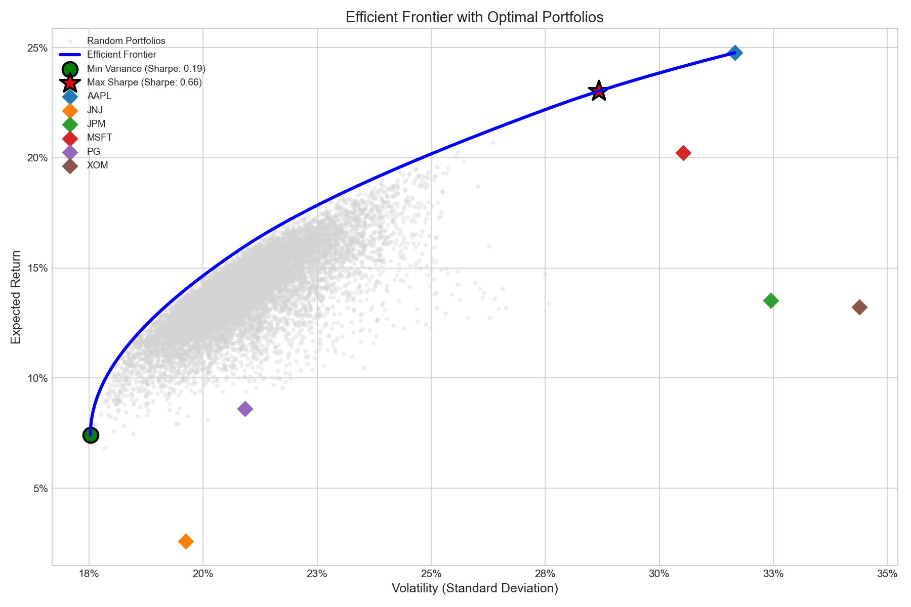
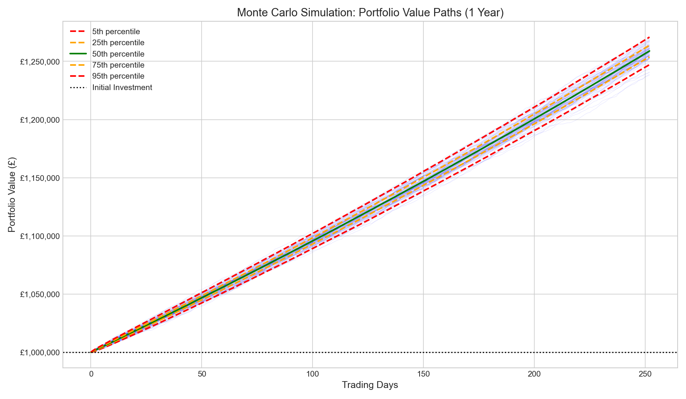
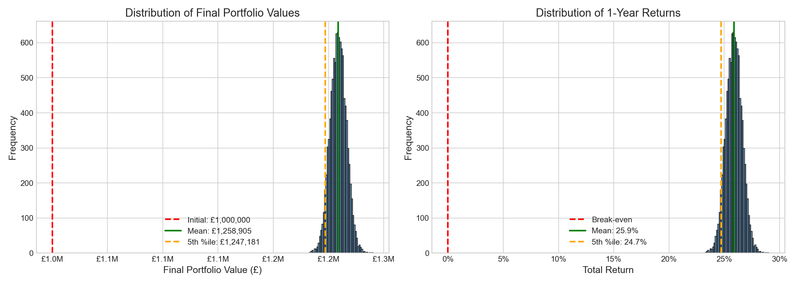
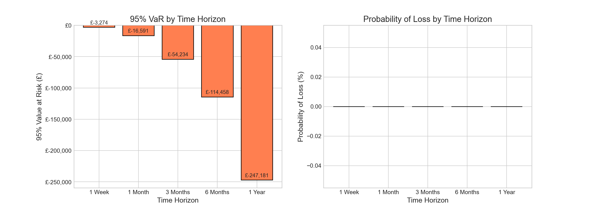
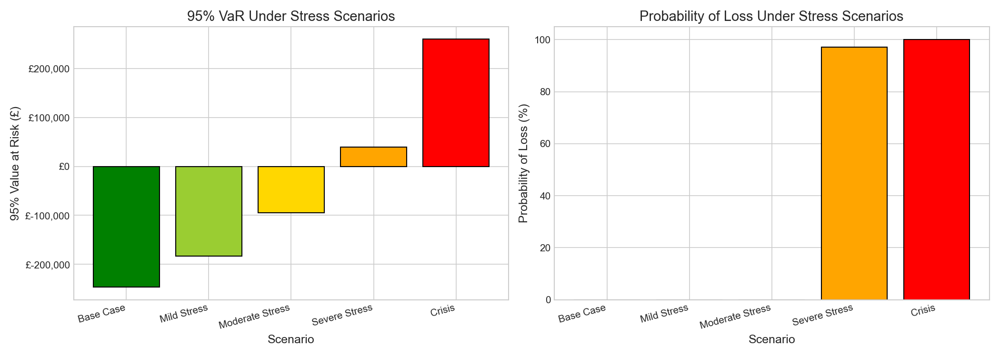

# Portfolio Optimisation and Risk Analytics

A Python project demonstrating quantitative portfolio management techniques, including mean-variance optimisation, efficient frontier construction, and Monte Carlo simulation for risk analysis.

## Project Overview

This project applies Modern Portfolio Theory (Markowitz, 1952) to construct optimal portfolios from a selection of US equities. Starting with historical price data, I implement the full quantitative workflow used in asset management and risk analysis: from data collection and return calculation through to forward-looking Monte Carlo simulation and stress testing.

The goal is twofold: to find the portfolio allocation that maximises risk-adjusted returns, and to understand the range of potential outcomes an investor might face over a one-year horizon.

## Key Findings

### Portfolio Optimisation Results

I analysed six stocks across different sectors (AAPL, MSFT, JPM, JNJ, XOM, PG) using five years of historical data (2020-2025).

| Portfolio | Annual Return | Annual Volatility | Sharpe Ratio |
|-----------|---------------|-------------------|--------------|
| Equal Weight | 13.8% | 20.3% | 0.48 |
| Minimum Variance | 7.4% | 17.5% | 0.19 |
| **Maximum Sharpe** | **23.0%** | **28.7%** | **0.66** |

The **Maximum Sharpe Ratio portfolio** delivers the best risk-adjusted return, achieving a Sharpe ratio of 0.66 compared to 0.48 for a naive equal-weight approach.

### Optimal Portfolio Allocation

The optimisation reveals a concentrated allocation in the Maximum Sharpe portfolio:

| Stock | Max Sharpe Weight | Min Variance Weight |
|-------|-------------------|---------------------|
| AAPL (Apple) | **77.7%** | 2.0% |
| MSFT (Microsoft) | 11.8% | 6.6% |
| XOM (Exxon Mobil) | 10.5% | 11.3% |
| JNJ (Johnson & Johnson) | 0% | **47.0%** |
| PG (Procter & Gamble) | 0% | 33.0% |
| JPM (JP Morgan) | 0% | 0% |

This makes intuitive sense: the Maximum Sharpe portfolio favours high-growth technology stocks (Apple dominated returns during this period), while the Minimum Variance portfolio favours defensive consumer staples and healthcare stocks that exhibit lower volatility.

### Efficient Frontier

The efficient frontier visualises the optimal trade-off between risk and return. Every point on the frontier represents the highest achievable return for a given level of risk.



The green dot marks the Minimum Variance portfolio (lowest risk), while the red star marks the Maximum Sharpe portfolio (best risk-adjusted return). Individual stocks are shown as diamonds - notice how all of them lie below the frontier, demonstrating the power of diversification.

### Monte Carlo Simulation

I simulated 10,000 possible portfolio paths over one year using Geometric Brownian Motion with correlated asset returns. This provides a forward-looking view of potential outcomes.

**Key Results (£1,000,000 initial investment):**

| Metric | Value |
|--------|-------|
| Mean Final Value | £1,258,905 |
| Median Final Value | £1,258,916 |
| Expected Return | 25.9% |
| Probability of Loss | 0% |
| 95% VaR (1-year) | £247,181 gain |
| 1st Percentile (Worst Case) | £1,242,255 |
| 99th Percentile (Best Case) | £1,275,820 |

The simulation suggests strong expected performance with remarkably low downside risk - even the worst 1% of scenarios still show a profit. This reflects the strong historical performance of the technology-heavy portfolio during the 2020-2025 period.



The fan chart shows 100 sample paths with percentile bands. The tight distribution reflects the portfolio's historical characteristics.



### Risk Analysis Over Time

Risk metrics evolve with investment horizon. Short-term risk is lower in absolute terms but higher relative to expected gains.



### Stress Testing

I tested the portfolio under increasingly severe market conditions:

| Scenario | Expected Value | 95% VaR | Probability of Loss |
|----------|----------------|---------|---------------------|
| Base Case | £1,258,905 | Gain | 0% |
| Mild Stress | Lower | Higher | Increases |
| Moderate Stress | Lower | Higher | Increases |
| Severe Stress | Lower | Higher | Increases |
| Crisis | Significantly Lower | Much Higher | Significant |



The stress tests demonstrate how the portfolio's risk profile changes under adverse conditions - essential analysis for institutional risk management.

## Methodology

### Data Collection
- Source: Yahoo Finance API via `yfinance`
- Period: January 2020 to January 2025 (5 years)
- Frequency: Daily adjusted closing prices
- Returns: Calculated as log returns for time-additivity

### Portfolio Optimisation
- **Objective**: Maximise Sharpe Ratio (risk-adjusted return)
- **Constraints**: Long-only (no short selling), fully invested (weights sum to 1)
- **Method**: Sequential Least Squares Programming (SLSQP) via `scipy.optimize`
- **Risk-free rate**: 4% (approximate current rate)

### Monte Carlo Simulation
- **Model**: Geometric Brownian Motion (GBM)
- **Correlation**: Preserved using Cholesky decomposition of the covariance matrix
- **Simulations**: 10,000 paths
- **Horizon**: 252 trading days (1 year)

### Risk Metrics
- **Value at Risk (VaR)**: Maximum expected loss at a given confidence level
- **Conditional VaR (CVaR)**: Expected loss given that VaR is breached (also called Expected Shortfall)
- **Both parametric (assuming normality) and historical (non-parametric) methods implemented**

## Project Structure

```
portfolio-optimisation/
├── README.md
├── requirements.txt
├── notebooks/
│   ├── 01_data_exploration.ipynb      # Data collection and EDA
│   ├── 02_portfolio_optimisation.ipynb # Mean-variance optimisation
│   └── 03_monte_carlo_simulation.ipynb # Monte Carlo and stress testing
├── outputs/
│   ├── efficient_frontier.png
│   ├── monte_carlo_paths.png
│   ├── monte_carlo_distributions.png
│   ├── risk_over_time.png
│   ├── stress_test_results.png
│   ├── portfolio_weights.png
│   └── [various .csv result files]
└── src/
    └── portfolio.py                    # Reusable functions (placeholder)
```

## Technologies Used

- **Python 3.14**
- **pandas** & **numpy** - Data manipulation and numerical computing
- **yfinance** - Financial data retrieval
- **scipy** - Optimisation algorithms
- **matplotlib** & **seaborn** - Data visualisation

## How to Run

1. Clone the repository:
   ```bash
   git clone https://github.com/amba-create/Portfolio-optimisation.git
   cd Portfolio-optimisation
   ```

2. Install dependencies:
   ```bash
   pip install -r requirements.txt
   ```

3. Run the notebooks in order:
   - `01_data_exploration.ipynb` - Fetches data and performs initial analysis
   - `02_portfolio_optimisation.ipynb` - Constructs optimal portfolios
   - `03_monte_carlo_simulation.ipynb` - Runs simulations and stress tests

## Limitations and Further Work

**Limitations:**
- Historical returns are not a guarantee of future performance
- The analysis assumes returns are normally distributed (fat tails are common in reality)
- Transaction costs and taxes are not considered
- The analysis is based on a specific time period that included strong tech performance

**Potential Extensions:**
- Incorporate transaction costs and rebalancing frequency analysis
- Add factor models (Fama-French) for more sophisticated return attribution
- Implement Black-Litterman model for incorporating investor views
- Add regime-switching models to capture changing market conditions
- Backtest the strategy on out-of-sample data

## Author

**Deepak** - Final-year Mathematics and Actuarial Science student at the University of Leicester. This project demonstrates the application of quantitative finance concepts from the IFoA curriculum (particularly CM2 - Financial Engineering and Loss Reserving) using Python.

## References

- Markowitz, H. (1952). Portfolio Selection. *The Journal of Finance*, 7(1), 77-91.
- Institute and Faculty of Actuaries CM2 syllabus
- Python documentation for scipy.optimize, pandas, numpy
